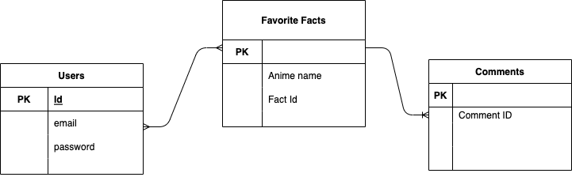

# Project 2 Anime Facts App

# Anime Facts
Love Anime? Me too! Did you know that characters, conflicts, storylines and other incredible details in many well known anime are inspired by real people/events? It's True! Welcome to Anime Faxx, the app that let's you search by anime title for true facts about that anime! You can also save the facts to your user profile and see your favorited facts. Users are also able to comment on their favorited facts and see all comments related to specific fact. 

# Search by these Animes: 
- bleach 
- naruto 
- one_piece 
- jujutsu_kaisen 
- black_clover 
- dragon_ball
- fma_brotherhood
- gintama
- demon_slayer
- attack_on_titan
- hunter_x_hunter
- boku_no_hero_academia

Enjoy learning more about anime!!!

# User Stories
- As a user i want to search anime by title
- As a user i want to see all fact results found 
- As a user i want to be able to save favorited facts
- As a user i want to be able to delete favorited facts
- As a user i want to be able to see the facts i have favorited & which anime they are from
- As a user i want to be able to comment on favorited facts
- As a user i want to be able to change my password

# MVP
- Sign up page
- Log in page
- Search page to search for true facts about an anime by title
- The ability to save favorite facts
- User's Profile page with link to their favorites
- User's favorited facts
- The ability to delete favorited facts from user's favorites
- The ability to comment on favorited facts

# Created using:
- HTML5
- JavaScript
    - NodeJs
    - Express
    - EJS
    - Axios
    - Bcrypt
    - Sequelize
    - Crypto-JS
- Heroku Deployment

# Sign Up

# Log In

# Search

# Results

# User's Favorite Faxx

# REST Routes

│ Method │ Path │ Verb | Description |

│ GET │ /users/new │ Sign up form |

│ POST │ /users │ Creates new user |

│ GET │ /users/login │ Log in form |

│ POST │ /users/login │ Authenticates user |

│ GET │ /users/logout │ Logs user out |

│ GET │ /users/profile │ Shows user profile |

│ GET │ /users/update │ Displays password update form |

│ POST │ /users/update │ Updates user password |

│ GET │ /anime │ Displays anime search form |

│ GET │ /anime/results │ Displays search results |

│ POST │ /faveFact │ Adds a fact to users faves |

│ GET │ /faveFact/favorites │ Shows User favorite facts |

│ DELETE │ /faveFact/favorites/:favoritesId │ Deletes a favorited Fact |

│ POST │ /comment/newComment │ Comments on a favorited fact |

# ERD

# Project Setup
- Fork and clone this repo
- Run npm i to install all dependencies
- Create a .env file
    - in the .env file add:
        DB_DATABASE=anime_facts_api
        DB_USER=postgres
        DB_HOST=localhost
        DB_PASSWORD=
        DB_PORT=5342
    - add an ENC_KEY and give it a value, this will act as the encryption key for password authentication
- Create database named anime_facts_api (the same as in config.json)
- Create models using sequelize
    - use sequelize model:create with the name and attributes matching those in the models folders
    - migrate models using sequelize db:migrate
- Project is now ready to deploy!